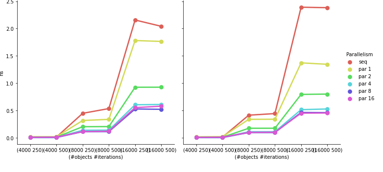

# Parallelized particle simulation with OpenMP

Here are some of the most significant results both using AOS and SOA while comparing with different number of threads. The simulation was run in a 16 GB RAM 8 core machine.

